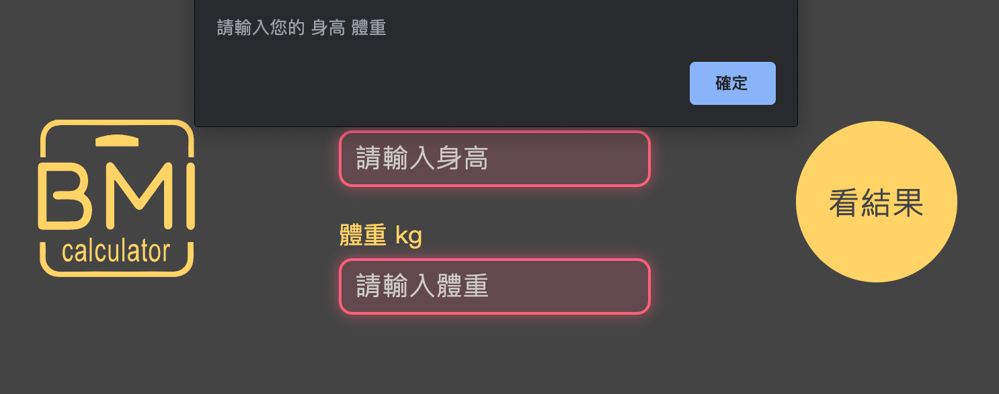

# 六角 BMI 計算機


標示文件：[https://hexschool.github.io/JavaScript_HomeWork/](https://hexschool.github.io/JavaScript_HomeWork/)
<br>
成品Demo：[https://erica1123.github.io/works/BMI/](https://erica1123.github.io/works/BMI/)

基本功能需求：
* 計算 BMI
* 判斷 BMI 範圍
* 重新輸入數值
* 變更結果顏色
* 印出紀錄日期、抓取時間
* 儲存 LocalStorage 紀錄 BMI 等數值

擴充功能：
* 檢查輸入內容是否正確
* BMI 紀錄排序
* 刪除紀錄

---

### 計算 BMI
BMI 的計算公式為 
<br>w = 體重，單位：公斤
<br>h = 身高，單位：公尺
<br>BMI = 身高體重指數，單位：公斤/平方公尺

這裡用到 JavaScripts 裡的數學運算 `Math.round()`、`Math.pow(x, y)`

1. `Math.round()` 四捨五入到最接近的整數值
2. `Math.pow(x, y)` 也就是 `Math.pow( 數字 , 次方 )`
3. 因為我們習慣用公分當作身高單位，所以用100公分換算 `Math.pow(身高/100, 2)`
4. 後面因為需要取到小數點後2位，所以先把 `體重/(Math.pow(身高/100, 2))` 乘以100
5. 再把小數點往前挪2位，最後公式就是：

```Math.round( (體重/Math.pow(身高/100, 2)) * 100 ) / 100```

<font color="red">**04/24更新 獨立狀態管理**</font>
<br>感謝助教 Ray 的建議，把 BMI 計算和 LS 儲存分別獨立管理
<br>改成用 return 回傳各值後再帶入 saveLS 函式儲存
```
return {
    _bmi: $bmi, 
    _weight: weight.value, 
    _height: height.value, 
    _msg: msg.textContent, 
    _tag: tag
}
```

<br><br>

### 變更顏色


依照標示文件需求，不同 BMI 數值會在結果圓圈搭配不同顏色
<br>所以在設計 CSS 時，先把需要變更的部分獨立出來，方便 Javascripts 切換使用
```
function changeColor($color) {
    result.style.background = $color; // 外圈背景色
    result.style.color = $color; // 文字顏色
    renew.style.background = $color; // 重新整理按鈕顏色
    return $color; // 回傳顏色
}
```

最後在判斷 BMI 範圍時，再將事先設定好的顏色陣列帶進函式
```
const colors = ['#86D73F', '#31BAF9', '#FF982D', '#FF6C03', '#FF1200'];
changeColor(colors[2]);
```

<br><br>

### 抓取時間
`getMonth()` 取得月份從 0 開始算起，所以需要+1
<br>另外因為排序需要，多設定一個 `today.getTime()` 會取出一段數字
<br>ex.1580911069807 // 由1970年1月1日零時零分計起到目前時間(毫秒)
```
function nowDate($date) {
    let today = new Date();
    let YY = today.getFullYear();
    let MM = (today.getMonth() + 1 < 10 ? '0' : '')+(today.getMonth() + 1);
    let dd = (today.getDate() < 10 ? '0' : '')+today.getDate();
    let tt = today.getTime();
    $date = MM + '-' + dd + '-' + YY ;
    return {_date: $date, _time: tt};
}
```

參考資料：[javascript時間Date()介紹與補零應用的技巧](http://zhi-yuan-chenge.blogspot.com/2015/10/jsjavascript_16.html)

<br><br>

### 數字補零 - 三元運算子
`a ? b : c` 運算子可當做 `if...else` 陳述式的簡短表示法：
<br>「 若日期小於10，在前面補0，反之則不補0 」
```
(today.getDate() < 10 ? '0' : '')+today.getDate()
```

同樣的程式碼但使用 `if...else` 陳述式：
```
if ( today.getDate < 10 ) { 
    '0' + today.getDate()
} else { 
    '' + today.getDate()
}
```

參考資料：[條件 (三元) 運算子](https://docs.microsoft.com/zh-tw/previous-versions/visualstudio/visual-studio-2010/zakwfxx4(v=vs.100)?redirectedfrom=MSDN)
<br>補充資料：[運算子優先順序](https://docs.microsoft.com/zh-tw/previous-versions/visualstudio/visual-studio-2010/fatf1t6a%28v%3dvs.100%29)

<br><br>

### 檢查輸入框


這裡我希望可以增加一個防呆檢查機制：
* 如果輸入的內容不等於0、空白、或非數字，才可以進行計算
* 反之則跳出提醒視窗

首先設定好條件：
```
1. $input[i].value == 0 // 內容等於0
2. $input[i].value.trim() == '' // 內容空白
3. isNaN($input[i].value) // 內容非數字
```

分別宣告一個放訊息和判斷內容的變數 `let msg = ''`、`let chk = true`
<br>然後再用迴圈把條件和判斷放進去，並且回傳 `msg`、`chk`的值：
```
const txt = [' 身高', ' 體重'];
let msg = '';   // 判斷訊息
let chk = true; // 判斷布林值
for (let i=0; i<$input.length; i++) {
    if ( $input[i].value == 0 || $input[i].value.trim() == '' || isNaN($input[i].value) ) {
        $input[i].classList.add('focus'); // blur失焦事件樣式
        msg += txt[i];
        chk = false;
    } else {
        $input[i].classList.remove('focus');
    }
}
return {_msg: msg, _chk: chk}
```

接著再用一個檢查函式來判斷剛剛檢查的結果：
* 若判斷後的值為 `true`，開始計算
* 若判斷後的值為 `false`，則跳出提醒視窗，並觸發 `blur` 事件
```
function checkFun() {
    let alert_msg = blurCheck(inputs)._msg; // 判斷後的訊息
    let alert_chk = blurCheck(inputs)._chk; // 判斷後的結果
    if ( alert_chk === true ) {
        calculate();
    } else {
        alert('請輸入您的' + alert_msg);

        // 用遍歷的方式觸發 blur 事件
        inputs.forEach(function($item){
            $item.addEventListener('blur', function(){
                blurCheck(inputs);
            });
        })
        return false;
    }
}
```

<br><br>

### 儲存 LocalStorage
基本功能都做好了計算也都沒有問題，接下來就是要儲存到 LocalStorage
<br>
<font color="red">**04/24更新**</font>
首先設定好我們需要儲存的內容：
```
let obj = {
    color: calculate()._tag, // 顏色條
    txt: calculate()._msg, // 計算範圍結果
    bmi: calculate()._bmi, // ＢＭＩ值
    weight: calculate()._weight, // 體重
    height: calculate()._height, // 身高
    date:  nowDate()._date, // 紀錄日期
    time: nowDate()._time // 排序用的時間（畫面上不會顯示）
}
```

接著，要寫要呈現在畫面的元件
```
function update(recordItem) {
    let cont = '';
    for (let i=0; i<recordItem.length; i++) {
        cont += 
        `<li data-list=${i}>
            <div class="list-msg">
                <span class="tag ${recordItem[i].color}"></span>
                <span class="txt">${recordItem[i].txt}</span>
            </div>
            <div class="list-bmi">${recordItem[i].bmi}</div>
            <div class="list-weight">${recordItem[i].weight}kg</div>
            <div class="list-height">${recordItem[i].height}cm</div>
            <div class="list-date">${recordItem[i].date}</div>
            <i class="material-icons delete"  data-clear="${i}">delete</i>
        </li>`
    }

    // 判斷沒有資料時，顯示文字
    if (save.length >= 1) {
        recordBox.innerHTML = cont;
    } else {
        recordBox.innerHTML = '還沒有BMI紀錄，快來面對現實吧！';
    }
}
```

因為 LocalStorage 會自動把內容轉成字串，所以：
<br>
**原本的做法**
```
**存入資料**
1. let array = []; // 宣告一個空陣列
2. array.push(obj); // 置入obj
3. let toString = JSON.stringify(array); // 宣告並把陣列轉成字串
4. localStorage.setItem('record', toString); // 取名 record 並存入 LS
```
> => localStorage.setItem('record', JSON.stringify(array));

```
**取出資料**
1. let getString = localStorage.getItem('record'); // 宣告並從 record 取出 string
2. let getAry = JSON.parse(getString); // 宣告並將 getString 這個 string 轉回陣列
=> let getAry = JSON.parse(getString) || []; // 若沒有資料則給空陣列
```
> => let getAry = JSON.parse(localStorage.getItem('record')) || [];

**簡化之後的做法**
```
1. const save = JSON.parse(localStorage.getItem('record')) || []; //把 LS 內容轉成陣列，並移到外面宣告
2. save.push(obj); // 把 obj 的值 push 到 save 的空陣列
3. localStorage.setItem('record', JSON.stringify(save)); // 把陣列存到 LS 並轉成字串
4. update(save); // 執行 update 並取出 save 資料
```

**新增資料按照建立時間排序**
<br>最後，之前提到在畫面上不會顯示的 `time: nowDate()._time`
<br>這裡用 sort 把取出的最近一筆資料依照順序往下排列
```
save.sort(function(a, b){
    return new Date(b.time) - new Date(a.time); 
})
```

---

### 結語
以上就是這次實作過程，如果觀念上有任何問題還請不吝指教，感謝！｡:.ﾟヽ(*´∀`)ﾉﾟ.:｡
