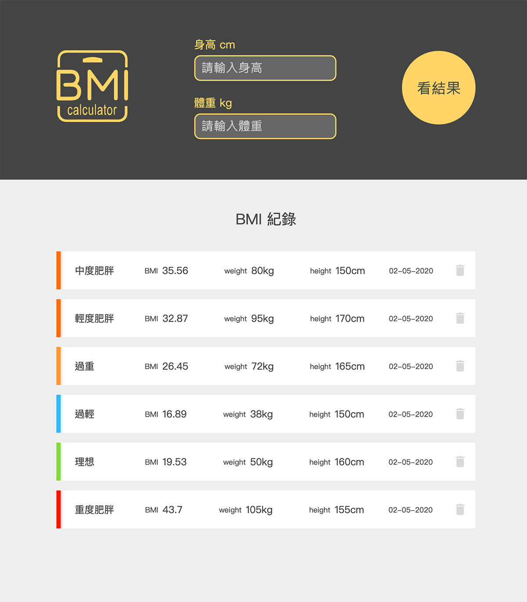
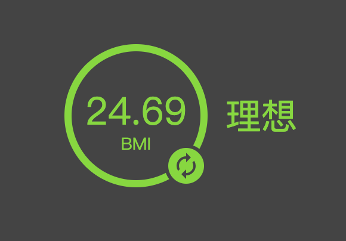

# 六角 BMI 計算機


標示文件：[https://hexschool.github.io/JavaScript_HomeWork/](https://hexschool.github.io/JavaScript_HomeWork/)
成品Demo：[https://erica1123.github.io/works/BMI/](https://erica1123.github.io/works/BMI/)

基本功能需求：
* 計算 BMI
* 判斷 BMI 範圍
* 重新輸入數值
* 變更結果顏色
* 印出紀錄日期、抓取時間
* 儲存 LS 紀錄 BMI 等數值

擴充功能：
* 檢查 input 值是否正確
* BMI 紀錄排序（目前尚有問題）
* 刪除紀錄

---

### 計算 BMI
BMI 的計算公式為 
w = 體重，單位：公斤
h = 身高，單位：公尺
BMI = 身高體重指數，單位：公斤/平方公尺

這裡用到 JavaScripts 裡的數學運算 `Math.round()`、`Math.pow(x, y)`
```
1. Math.round() 四捨五入到最接近的整數值
2. Math.pow(x, y) 也就是 Math.pow( 數字 , 次方 )
3. 因為我們習慣用公分當作身高單位，所以用100公分換算 Math.pow(身高/100, 2)
4. 後面因為需要取到小數點後2位，所以先把 體重/(Math.pow(身高/100, 2)) 乘以100，
5. 再把小數點往前挪2位，最後公式就是 
Math.round( (體重/Math.pow(身高/100, 2)) * 100 ) / 100
```

### 變更顏色

依照標示文件需求，不同 BMI 數值會在結果圓圈搭配不同顏色
所以在設計 CSS 時，先把需要變更的部分獨立出來，方便 Javascripts 切換使用
```
function changeColor($color) {
    result.style.background = $color; // 外圈背景色
    result.style.color = $color; // 文字顏色
    renew.style.background = $color; // 重新整理按鈕顏色
    return $color; // 回傳顏色
}
```
最後在判斷 BMI 範圍時，再將事先設定好的顏色陣列帶進函式
```
const colors = ['#86D73F', '#31BAF9', '#FF982D', '#FF6C03', '#FF1200'];
changeColor(colors[2]);
```

### 抓取時間
`getMonth()` 取得月份從 0 開始算起，所以需要+1
另外因為排序需要，多設定一個 `today.getTime()`
最後會取出一段數字 ex.1580911069807 (由 1970年1月1日零時零分計起到目前時間) 單位:(毫秒)
```
function nowDate($date) {
    let today = new Date();
    let YY = today.getFullYear();
    let MM = (today.getMonth() + 1 < 10 ? '0' : '')+(today.getMonth() + 1);
    let dd = (today.getDate() < 10 ? '0' : '')+today.getDate();
    let tt = today.getTime();
    $date = MM + '-' + dd + '-' + YY ;
    return {_date: $date, _time: tt};
}
```
### 數字補零 - 三元運算子
`a ? b : c` 運算子可當做 `if...else` 陳述式的簡短表示法
```
(today.getDate() < 10 ? '0' : '')+today.getDate()
```
同樣的程式碼但使用 `if...else` 陳述式：
```
if ( today.getDate < 10 ) { 
    '0' + today.getDate()
} else { 
    '' + today.getDate()
}
```
[參考資料](http://zhi-yuan-chenge.blogspot.com/2015/10/jsjavascript_16.html)


