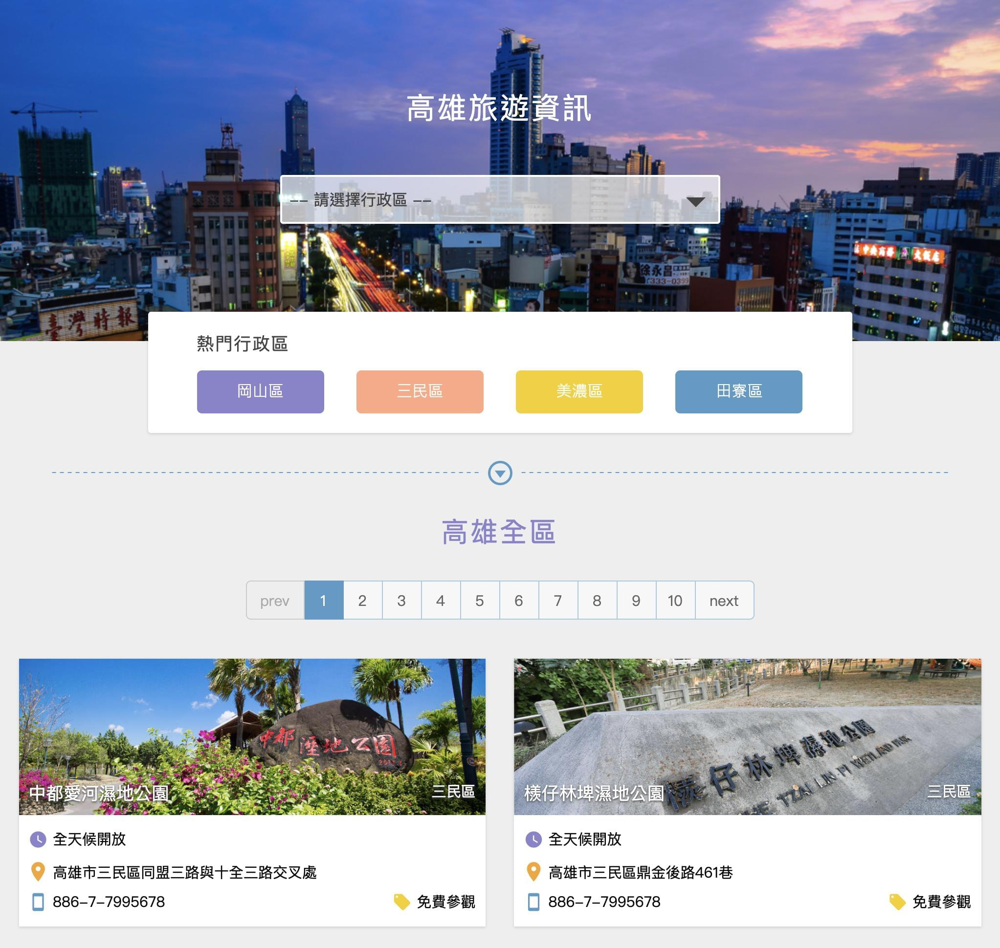

# 高雄旅遊資訊


標示文件：[https://hexschool.github.io/JavaScript_HomeWork/](https://hexschool.github.io/JavaScript_HomeWork/)
<br>
成品Demo：[https://erica1123.github.io/works/Travel/](https://erica1123.github.io/works/Travel/)

基本功能需求：
* 串接API取得資料
* 下拉選單對應取出不重複地區
* 依照選擇地區切換資料
* 分頁邏輯
* 依照分頁切換資料
* 畫面置頂功能

擴充功能：
* 依照景點地址外連 Google map
* 用 input radio 製作下拉選單

---

### 串接API取得資料
使用 axios 取得 api 資料
```javascript=
let jsonData = []
axios.get(api).then( res => {
  jsonData = res.data.result.records
}).catch( err => {
  console.log(err)
})
```

<br><br>

### 下拉選單對應取出不重複地區
1. 宣告兩個空陣列，先取出資料裡的所有地區
2. 再用 `filter()` 和 `indexOf()` 過濾出不重複地區
```javascript=
function menuSelect(data){
    let zone = [],
        list = []
    // 先取出資料裡所有的地區
    data.forEach( i => {
    zone.push(i.Zone)
})
// 過濾不重複地區，並回傳
list = zone.filter( (e, i, arr) => {
    return arr.indexOf(e) === i
    })
    return list
}
```

<br><br>

### 依照選擇地區切換資料
首先準備更新的內容，每次資料更新就重新執行一次
```javascript=
// 資料更新
function update(data) {
  cards.innerHTML = ''
  for( let i=0; i<data.length; i++ ){
    let cont = `
    <li class="card-item">.....</li>`
    cards.innerHTML += cont
    
    // 判斷票價資訊，沒有內容則不顯示
    const tickets = document.querySelectorAll('.ticketinfo')
    if( data[i].Ticketinfo == '' ){
      tickets[i].style.display = 'none'
    }
  }
}
```
1. 因為有兩個切換地區的部分：下拉選單、熱門行政區按鈕
2. 所以在函示內多帶一個變數 `target`
3. 依照每次點擊的地區，把 `data` 用 `filter` 比對出相同地區
4. 符合條件的資料，就 `push` 到陣列中
5. 再把結果帶回先前準備的 `update()` 函式裡
```javascript=
// 切換地區
function switchData(target, data) {
  let cont
  target.forEach( item => {
    item.addEventListener('click', () => {
      placeholder.textContent = item.value
      cardTitle.textContent = item.value
      cont = []
      data.filter( d => {
        if( d.Zone == item.value ){
          cont.push(d)
        } else if (item.value == '高雄全區'){
          cont = data
        }
      })
      update(cont)
    })
  })
}

// 啟動事件
function events(data){
  const options = document.querySelectorAll('.select-wrap li input')
  const tags = document.querySelectorAll('.tags button')
  switchData(options, data)
  switchData(tags, data)
}
```

<br><br>

### 分頁邏輯
之前寫過一篇關於分頁拆解的筆記，可參考：[媽呀！又是分頁！](https://hackmd.io/pLyb5TWGT7Wittt63fuyUg)
```javascript=
function pagination(data, current) {
  const perPage = 6
  const pages = {
    nowPage: current,
    totlePage: Math.ceil(data.length / perPage),
    minData: (current - 1) * perPage + 1,
    maxData: current * perPage
  }
  let newData = []
  data.forEach( (item, index) => {
    let num = index + 1
    if( num >= pages.minData && num <= pages.maxData ){
      newData.push(item)
    }
  })
  update(newData)
}
```

<br><br>

### 依照分頁切換資料
```javascript=
function switchPage(e){
  if( e.target.nodeName !== 'A' ) { return }
  let page = e.target.dataset.page
  pagination(jsonData, page)
}
```
在首頁切換分頁沒問題後，發現在各地區切換分頁會發生錯誤
<br>
這時候要在切換地區的函示做些調整
```javascript=
function switchData(target, data) {
  let cont
  target.forEach( item => {
    item.addEventListener('click', () => {
      ...
      // 切換分頁時，替換最外層資料
      jsonData = cont
    })
  })
}
```

---

### 參考資料
[scroll-behavior 滑順的捲動效果](https://andyyou.github.io/2016/06/01/smooth-page-scroll//)